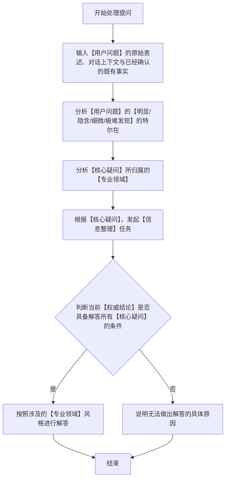

### 适用
 适用于用户最新一轮意图属于提问类型的场景：需要先把用户真正要问的疑问问清、把疑问所属的专业领域认准，再发起【信息整理】任务取得【权威结论】，最后依据【权威结论】给出可追溯的解答；任务类型取【信息整理】，交付类型取【权威结论】或【文件链接】。

### 问题解答逻辑流程图（**必须严格按照顺序执行，逐个节点执行，从开始到结束**）

```mermaid
flowchart TD
  START[开始处理提问] --> A[输入【用户问题】的原始表述、对话上下文与已经确认的既有事实]
  A --> B[分析【用户问题】的【明显/隐含/细微/极难发现】的特尔在]
  B --> C[分析【核心疑问】所归属的【专业领域】]
  C --> D[根据【核心疑问】，发起【信息整理】任务]
  D --> E{判断当前【权威结论】是否具备解答所有【核心疑问】的条件}
  E -- 是 --> F[按照涉及的【专业领域】风格进行解答]
  E -- 否 --> G[说明无法做出解答的具体原因]
  F --> END[结束]
  G --> END
```