### 适用
可变更产物的新增、修改、修复、重构、优化，以及实际改动闭环

### 执行变更流程图（**必须严格按照顺序执行，逐个节点执行，从开始到结束**）

```mermaid
flowchart TD
START[开始] --> A[输入【执行变更】任务完整具体的信息]
A --> B[分析【变更目标】、【变更对象】、【大致变更范围】以及【变更方式（重构/续写/新增/修订）】]
B --> C[以每个【变更目标】下所有的【大致变更范围】为【原点】，全面查找【关联变更】和链路结构]
C --> D[调用可用工具，查找与当前变更关联的【架构】、【参考文档】、【可复用对象】等资料，并依据【变更目标】分析【适配度】]
D --> E[仅保留【适配度】>=【良好】的【架构】或【可复用对象】作为【变更方案材料】]
E --> E1[分析每个【大致变更范围】所属【变更方式】，重点标记变更方式为【重构】时与【旧内容】的冲突]
E1 --> E2[以尽可能避免发生【变更冲突】为目的，准确制定【变更范围】]
E2 --> F[依据当前所有已知事实，设计一个能够完成所有【变更目标】的【变更方案】最初版本]
F --> F1[补充实际【验收方法】到【变更方案】中]
F1 --> F2[准备迭代【变更方案】，不限制迭代次数]
F2 --> G[尝试发现【变更方案】中,若实现变更会造成的【细微数据链路断口】或【细微逻辑链路断口】并作重点标记]
G --> G1[尽最大努力查找【关联变更】并补充和更新到【变更方案】中]
G1 --> H[以当前【变更方案】为原点【发散思考】，补充和修订【变更方案】]
H --> H1[以当前【变更方案】为原点【发散思考】，尽可能降低【副作用】并更新【变更方案】]
H1 --> J[收敛【变更方案】，使其只有唯一的【核心思路】]
J --> K[收敛和修剪【变更方案】，使其【每个数据链路和逻辑链路】保持闭环]
K --> K1[剪除超出【变更范围】或存在【越界变更】的内容，并更新【变更方案】]
K1 --> L[生成一个【假设性结论 X】:当前【变更方案】中包含了所有【关联变更】]
L --> L1[生成一个【假设性结论 Y】:当前【变更方案】是【最简洁、最自洽、副作用最低】的]
L1 --> M[交叉分析当前【变更】方案的【显式/细微/极难发现/隐含】特征并作重点标记]
M --> M1[尽最大努力查找【推翻】【结论X 或者 结论Y】的【权威证据】]
M1 --> N{判断是否存在【可推翻】【结论X 或者 结论Y】的【权威证据】}
N -- 是 --> O[依据当前所有已知事实，深度分析更多【非常规/细微/极难发现/隐含】线索并记录,准备下一个迭代]
O --> G
N -- 否 --> P[按照【审查标准】对当前【变更方案】进行审查]
P --> Q{判断当前【变更方案】是否【审查通过】}
Q -- 是 --> R[搜索当前环境下，适配当前变更且用于【语法核验】或者【规范核验】的独立工具或程序]
Q -- 否 --> Q1[记录当前变更方案设计【已致命偏离】同时记录设计过程，删除当前【变更方案】并准备重构]
Q1 --> F
R --> S[搜索当前环境下，适配当前变更且用于【语法核验】或者【规范核验】的独立工具或程序]
S --> S1[搜索当前环境下，适配当前变更的【版本管理】独立工具或程序]
S1 -->S2[结合【变更方案】中的【验收方法】以及【变更核验规范】，综合形成【至少四个核验步骤】并记录到【临时文件】]
S2 --> T[开启事务模式并依据【变更对象】执行备份]
T --> T1[依据【变更方案】，按照【变更执行规则】逐步执行]
T1 --> U{判断是否【执行成功】}
U -- 是 --> V[逐步执行【至少四个核验步骤】并获取核验结果]
U -- 否 --> W[输出变更失败并说明详细原因，发起事务回滚并还原所有变更内容]
V --> X{判断是否核验成功并输出完整【核验证据链】}
X -- 是 --> Y[输出执行变更成功和所有【变更差异】等内容]
X -- 否 --> W
Y --> Z[退出事务模式，并清理临时文件和无需保留的.bak文件或者备份]
W --> Z
Z --> END[结束]
```

### 关键定义和解释
1. 【大致变更范围】：每个【变更目标】的每个【变更方式】有且只有一个【大致变更范围】，此处不需要精确但务必确保覆盖对应的【变更目标】；后续的【变更范围】则需精确，是一个由粗到细的调查过程。
2. 【变更方式】：通常指（新增/修改/删除），一个【大致变更范围】只有一种【变更方式】。
3. 【关联变更】：是指在受当前执行变更影响的【逻辑链路】和【数据链路】中，为确保链路闭环与完整而必须同步修改的节点。
4. 【变更冲突】：是指【变更内容】影响到了与当前【执行变更】任务无关的部分。
5. 【越界变更】：是指【变更方案】中存在至少一个不符合【变更目标】的行为；目的是避免改掉不该改的东西。
6. 【审查标准】：是指需要仔细审查【变更方案】中的内容，至少审查以下几项（a~e）内容：
    - a.**必须全量检查是否完全符合所有【变更目标】，并且不存在任何【越界行为】**。
    - b.必须检查是否存在【一般/中等/严重/致命副作用】；只要存在【非轻微】副作用，一律视作审查失败。
    - c.检查方案中每个变更项存在没有【逻辑闭环】或者没有【数据流闭环】；若存在，一律视作审查失败。
    - e.检查方案中每个变更项是否存在【越界变更】；若存在，一律视作审查失败。

6. 【变更核验规范】：按顺序至少执行以下四个步骤：
    - a. 【语法核验】: 必须调用可用工具，至少使用代码语法检查工具，检查当前变更是否产生报错信息。
    - b. 【规范核验】: 必须调用可用工具，至少检查是否符合任务约束以及是否符合相关的【权威性文档】的所有要求。
    - c. 【生效核验】: 必须调用可用工具，依据方案中的【验收方法】进行核验并检查是否存在【变更遗漏】。
    - d. 【逻辑核验】: 必须调用可用工具，至少检查是否存在【占位性逻辑】、逻辑合理性（重点看主次关系、时序关系等）、逻辑闭环性。

7. 【变更执行规则】： 是指必须按照【变更方案】所示顺序逐步执行，同时必须严格符合以下要求：
    - a. 严格禁止任何的跳跃或者合并执行行为。
    - b. 绝对禁止任何占位性变更或者无实际意义的行为。
    - c. 若执行某个步骤失败，则优先排查执行操作是否出错并进行修复。
    - d. 若执行某个步骤失败，且执行操作无措，则尝试进行最小修复；并且若无法修复则视作【执行失败】，否则一律视作【执行成功】。

8. 【变更差异】：若git工具可用且是文本文件类型变更，则用当前文件(已变更状态)和备份文件(未变更状态)比对生成diff，需注意顺序。
9. 【副作用】：与当前任务无关，但深度交叉分析出现一些：【风险点、BUG、死锁、视觉问题、用户体验差、操作复杂度变高、信息重复、语义混乱】等其他类似情况都是副作用。
10. 【变更方案】：实际落地用于存储执行变更【临时文件】；执行变更全部完成之后就可删除。

### 附加全局约束
1. 【执行变更流程图】已为【最优、最简便、最权威】的处理逻辑，禁止其他任何优化处理操作。
2. 任何情况下都必须严格按照【执行变更流程图】从【开始】至【结束】，必须按【节点】顺序逐个执行，任何中断、跳过、重排、合并、改名等优化【流程节点】的行为，无论任何理由一律视作【致命错误】。
3. 交付物为【文件链接】时，URL 核验逻辑必须改用文件是否存在核验逻辑替代；因为URL 由外层组装，故必须采用此方式。
4. 查找材料的过程中，需要重点关注输入和输出具体的值、生产和消费链路、时间线、约束和规范、组织结构、触发条件、判断逻辑等；并且调研分析不能只停留在表层特征（如：字段名、变量名），必须做深度挖掘或溯源。
5. 若当前执行变更任务已完成但存在不符合【任务约束】的变更，则必须视作失败，回滚事务至未变更状态。
6. 【特征比对和确认】：若只比对表层含义或者标识，一律视作【严重错误】，这是因为这种比对必然出现【张冠李戴】的结果，必须比对每个核心要素和每个细节才能确认。
7. 在设计【变更方案】前，调研相关资料务必先对资料做有【事实依据】的彻底分类和【权威性打分】，目的是：避免对资料理解出现偏差从而出现【幻觉现象】。
8. **若变更对象相关环境下，存在并实际使用了【版本管理】工具，则.bak文件或者备份视作【无需保留】**
9. 调研过程中，尽可能鉴别【幽灵信息】，因为【幽灵信息】会引导至错误的执行结果。
10. 变更方式为【重构】可以不必顾及与【旧内容】冲突，**但【重构】必须【谨慎】并且完全符合【任务要求】，同时在【任务约束】的范围之内**。

### 附加输出要求
1. 必须记录并输出按【执行变更流程图】实际执行的【流程节点链路】。
2. 必须输出【执行概要】、【已执行变更项】。
3. 必须输出【核验证据链】和【至少四个核验步骤】。
4. 必须输出每个【变更对象】的每个【变更差异】。
5. 必须输出【变更方案】迭代总次数和每次迭代过程。

