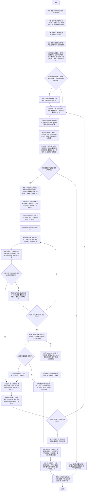

### 适用
报错、异常、差异、瓶颈、错误结果、状态不一致、内容不符、流程不通、产物不达标等问题追踪、根因链路定位和影响范围判断。

### 单条问题诊断流程图（**必须严格按照顺序执行，逐个节点执行，从开始到结束**）

### 根因的复核规则（**必须严格遵守，并完全符合以下两条规则才算复核成功**）
 1. 模拟符合【根因】的场景，沿着链路逐个节点进行推导，直到完整产生所有【错误现象】为止（**简单来说就是需证明因为这些【根因】导致了所有【错误现象】，其他【根因】无法导致所有【错误现象】**）。
 2. 依据【错误现象】进行反向推导，找到【根因】所在节点（**简单来说就是需证明所有【错误现象】产生的来源有且仅有这些【根因】，无任何其他来源**）。

### 关键定义和说明（**必须严格遵守**）
 1. 【诊断日志】：实际落地用于存储问题诊断记忆的【临时目录】，可以存放多个文件，同时允许回溯调研历史；问题诊断全部完成之后就可删除。
 2. 【备选诊断方向集合】：实际落地用于存储问题诊断方向的【临时文件】，json格式；问题诊断全部完成之后就可删除。
 3. 【关键要素】：包含输入条件、输出条件、视觉特征、视觉颜色、判断逻辑、触发机制、标点符号类型、组织架构等。
 4. 【风险修改点】：风险点是指若修正此问题时，会引发一些【极难发现】的且致命或严重的问题而给出【必要的风险提示】以免偏离正确的修正方向，必须至少考虑以下几个方面：
    - a.**任何为了修正此问题，而导致原有正常逻辑和时序（特指与此问题无关的逻辑和时序）被破坏或者删除的方法，一律视作【致命】或者【严重】风险**。
    - b.**任何为了修正此问题，而导致整体系统运作出现阻塞甚至阻断，一律视作【致命】或者【严重】风险**。
    - c.**任何为了修正此问题，而导致视觉效果出现变化，依据【实际情况】视作【中等】或者【轻微】风险**。

 5. 【探索研究】：针对问题诊断的探索研究，必须依次执行以下（a~d）全部的步骤：
    - a.**全面且系统性进行调查，尽最大努力查找所有与【错误现象】关联的【逻辑链路、数据流、时序流、触发条件等】并获取相关证据链**。
    - b.**从获取的事实和证据链中，尽最大努力重点标记所有【细微/极难发现/隐含】的特征，且若存在【视觉证据】则绝对不得遗漏任何【视觉特征】**。
    - c.**做完以上两步之后，再根据所有已知事实和证据链，尽最大努力全面发掘所有【显式/细微/极难发现/隐含】的线索，给查找【诊断方向】提供依据**。
    - d.**以上三步做完之后，剪除所有【假设性信息】，同时整理和归纳所有【证据链完整的结论】和所有已发现的【线索】**。

 6. 【诊断报告】：是一份MarkDown格式的文件，详细记录了已定位的【根因】以及【触发当前问题的具体场景】还有【风险修改点】，**必须注意此报告，只展示定位问题的结果，不给出任何修改建议**。

 7. 【诊断方向选取规则】：必须严格依据以下规则，以及优先级来择优选取（**LV4 为最高优先级，LV1为最低优先级**），最多选择3个诊断方向：
     - LV4 诊断方向中存在完整【证据链】或明确的事实。
     - LV3 诊断方向中存在【显式/隐式/细微/极难发现】等各种类型的线索。
     - LV2 诊断方向中存在以事实证据为依托并且**逻辑合理**的【假设条件】和【预设条件】。
     - LV1 诊断方向中存在没有依据为依托并且**逻辑合理**的【假设条件】和【预设条件】。

### 附加执行约束（**必须严格遵守**）
 1. 【单条问题诊断流程图】是唯一执行标准和【最优、最简便、最权威】的处理逻辑，禁止其他任何优化处理操作。
 2.  任何情况下都必须严格按照【单条问题诊断流程图】从【开始】至【结束】，必须按【流程节点】顺序逐个执行；任何中断、跳过、重排、合并、改名等优化【流程节点】的行为，无论任何理由一律视作【致命错误】。
 3. 若有多条问题，则遍历问题集合，每条问题必须按照【单条问题诊断流程图】去执行。
 4. 【特征比对和确认】：若只比对表层含义或者标识，一律视作【严重错误】，这是因为这种比对必然出现【张冠李戴】的结果，必须比对每个核心要素和每个细节才能确认。
 5. 部分文档存在修订内容（例如：DOCX文档），需仔细甄别，默认以最新修订内容为准。
 6. **你必须意识到，在无任何完整闭合的证据链佐证的情况下，任何假设都可能导致最终定位的【根因】存在严重偏差**。
 7. **无论是【常规诊断方向】还是【非常规诊断方向】都【不得遗漏】排查【脏数据】造成所有【错误现象】的可能性**。
 8. **必须注意：在定位【根因】时，即使存在多个【根因】共同作用的概率，【根因】所在的【完整链路】都具备【唯一性】；若存在任何不唯一的情况，则说明【根因】定位存在【致命的定位偏离】**

### 执行完成附加输出要求（**必须严格遵守**）
 1. 必须记录并输出每条问题按【单条问题诊断流程图】实际执行的【流程节点】链路。
 2. 输出必须包含完整的【诊断报告】和完整的【诊断过程】。
 3. 输出必须详细说明从【节点J】开始的，完整循环迭代论证过程。
 4. 输出必须包含，【已发现】的与当前【任何一个问题】有关的，【显式/隐式/细微/极难发现】的线索。
 5. 输出必须包含，所有已发现的每个问题的【诊断方向】。
 6. 输出必须包含，【根因】的完整复核过程。
 7. 输出必须包含，所有已发现的【风险修改点】。
 8. 输出必须包含，每次【探索研究】的完整过程和每次【诊断方向选取】的完整过程。