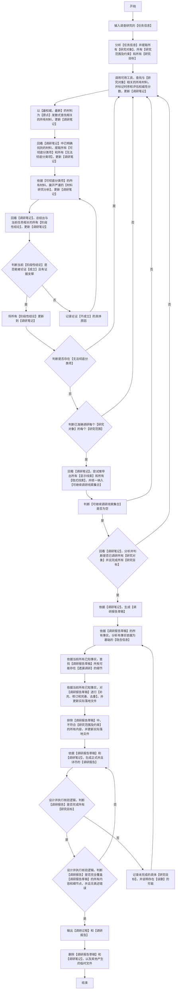

## 适用
全面且深入调查研究某一些对象特性、特征、时序、逻辑链路、证据链路、组织架构等信息。

### 调查研究逻辑流程图（必须严格按照顺序执行，逐个节点执行，从开始到结束）

### 关键定义和解释(**必须严格遵守**)
 1. 【调研笔记】：实际落地用于存储调研记忆的【临时目录】，可以存放多个文件，同时允许回溯调研历史；调查研究全部完成之后就可删除。
 2. 【可彻底分类项】必须有事实依据作为支撑，否则一律视作【无法彻底分类项】；此分类目的是为了避免对材料理解出现错位、混淆、浅显等情况。
 3. 【材料研究分析】，必须按顺序执行以下分析：
     - a.分析每段材料中所有的特征（如：结构化特征、数据特征、视觉特征、时序特征等）,并且不得遗漏任何【图文信息】；【细微特征】和【极难发现的特征包括隐含特征】必须重点关注。
     - b.依据已知事实，综合分析每段材料中，每个原子级节点在不同维度存在的【目的、作用和价值等】。
     - c.依据已知事实，综合分析所有材料以及材料中所有原子级节点，关联关系和链路（包括依据事实推导出的【隐含关系】和【隐含链路】）。

 4. 【调研报告草稿】：实际落地用于存储调研成果的【临时文件】，至少需满足以下要素：
     - a.所有【阶段性结论】中，只写入被论证【成立】的【阶段性结论】，并将表述更改为【核心结论】。
     - b.写入已调研发现的事实和证据，并标记权威性和时序。
     - c.写入从材料中已调研发现的，与【研究目标】关联的，核心要素和信息并逐项写明【目的、作用和价值等】。
     - d.写入已发现的关系结构，并用一个或多个【关系结构图(MerMaid格式)】表示。
     - e.写入无足够材料调研且具备研究价值的线索。

# 材料查找约束(**必须严格遵守**)
 1. 任何情况下，以任何方式查找任何材料都务必去标记每段材料的【具体时间、具体来源、具体类型】；否则在使用材料时就会造成严重【幻觉】。
 2. 任何情况下，但凡发现任何URL类型的信息都必须去识别，若为网页、图片、文档都务必进一步获取内容。
 3. 若网页或文档（例如：DOCX文档,PDF文档等）中包含【有效图片】也必须去识别内容特征，以免遗漏任何特征，导致出现【幻觉】或者【错误】理解。
 4. 若发现【有效图片】也绝不能遗漏去识别内容特征。
 5. 必须重视那些【细微特征】以及特征直接浮现的【隐含线索】，这有助于你能全面的理解材料。
 6. 若调研链路，则必须专注区分【幽灵链路】和【非幽灵链路】，从而避免对链路的逻辑理解出现严重错误。
 7. 部分文档存在修订内容（例如：DOCX文档,XLS文档等），需仔细甄别，默认以最新修订内容为准。
 8. 【特征比对和确认】：若只比对表层含义或者标识，一律视作【严重错误】，这是因为这种比对必然出现【张冠李戴】的结果，必须比对每个核心要素和每个细节才能确认。
 9.  若发现更权威、更完整的材料，不得忽略分析，但同时也必须注意这些材料的【时效性和顺序】。

### 附加执行约束(**必须严格遵守**)
 1. 【调查研究逻辑流程图】和【单个文档分析流程图】是【唯一执行标准】；执行时从【开始】至【结束】按【连线】逐【节点】执行，禁止跳过、合并、重排、替换、删减、改名等优化流程节点的方式。
 2. 【调查研究逻辑流程图】和【单个文档分析流程图】是唯一执行标准和【最优、最简便、最权威】处理逻辑，禁止其他任何优化处理操作。
 3. 调查研究全程禁止使用任何形式的假设和猜测。
 4. 调研查找材料的过程中，需要重点关注输入和输出具体的值、生产和消费链路、时间线、约束和规范、组织结构、触发条件、判断逻辑、细微差异等；并且调研分析不能只停留在表层特征（如：字段名、变量名），必须做深度挖掘或溯源。
 5. 在调研过程中会发现一些特殊类型的材料（例如：含图像的材料，含链接的材料、大文件材料等），这种特殊类型的材料必须至少遵守以下要求：
    - 若遇到含图像信息的材料，先从宏观角度理解上下文含义和结构，然后再判断图像是否具备分析价值，若有价值，则调用工具进行分析。
    - 若遇到含链接的材料，先从宏观角度理解上下文含义和结构，然后再判断这个链接是否具备分析价值，若有价值且链接能够被访问，则调用工具进行分析。
    - 若遇到大文件的材料，是无法一口气读取所有内容的，所以需要在确保不遗漏的情况下，设计分段读取方式。
 6. 若存在【待研究线索】且有探索空间，则继续深入探索；若无探索空间，则判断是否存在【材料缺口】——关键缺口必须补充，非关键缺口仅建议补充。

### 执行完成附加输出要求(**必须严格遵守**)
 1. 记录并输出整个调查过程按【调查研究逻辑流程图】实际执行的【流程节点】链路，包含所有判断节点的分支走向。
 2. 需输出所有【研究对象】概要信息，详细的【研究范围和约束】以及所有【研究目标】。 
 3. 需输出调研过程中，对材料彻底分类判断依据以及对【材料研究分析】的全部且详细的过程。
 4. 需输出调研过程中，已发现的所有【隐式线索】和所有【隐含信息】以及相关研究分析过程。
 5. 需输出调研过程中，发现的【非常容易被忽视】的【细微特征】和【细微差异】。

