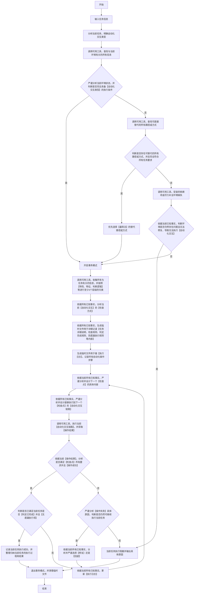

### 适用
授权目标真实动作执行、请求返回核对、浏览器可见状态核对、远程环境状态核对、界面反馈核对、文件链路核对、截图识别取证

### 自动化交互流程图（**必须严格按照顺序执行，逐个节点执行，从开始到结束**）

### 自动化交互方式规则
1. 含界面交互：
   - 若交互对象是网站，则优先选择连接到现有的浏览器做自动化交互，若现有的浏览器无法使用，则在网络允许的情况下，再考虑下载浏览器进行交互。
   - 若交互对象是界面窗口，则必须使用符合当前操作系统的，自动化操作UI的方式进行交互（例如：Windows UI 自动化交互）。
   - 兜底情况就是选择符合当前操作系统的自动化操作UI的方式。
2. 不含界面交互，可是情况用现有工具进行交互，若没有，则在网络允许的情况下，可尝试下载工具进行交互。
3. **含界面交互的【执行步骤】绝对禁止降级为不含界面交互【执行步骤】，职责不能混淆；若确认无法执行，直接中断任务并说明原因**

### 关键定义和解释
1. 检查点：是指经过一系列操作之后，需要收集必要特征（如：数据特征、视觉特征等）然后充分理解当前【自动化执行】状态，从而明确【下一步该做什么】的关键点。
2. 检查方式：核验自动化操作具体执行状态的方式，必须遵守以下规则：
  - 默认情况下取自动化操作相关输出信息或文件。
  - 若包含视觉的操作（如：自动操作浏览器，自动操作客户端等），则必须留存视觉信息（如：网页截图，屏幕截图等）用于分析视觉特征。
  
### 附加全局约束
1. 【自动化交互流程图】已为最优处理逻辑，故此禁止其他任何优化处理操作。
2. 任何情况下都必须严格按照【自动化交互流程图】从【开始】至【结束】，必须按【节点】顺序逐个执行，不得中断；禁止跳过、合并等其他所有优化流程执行方式。
3. 与浏览器交互时，需尽量避免关闭其他无关且已经打开的浏览器页面。
4. 利用工具或者程序进行交互时，也需尽量避免关闭其他无关的程序或页面。
5. 交互环境尽可能防止其他干扰。
6. 若交互环境需要保留承接信息，则需要落入中间文件并提供文件绝对路径。
7. 【特征比对和确认】：若只比对表层含义或者标识，一律视作【严重错误】，这是因为这种比对必然出现【张冠李戴】的结果，必须比对每个核心要素和每个细节才能确认。
8. 调研过程中，尽可能鉴别【幽灵信息】，因为【幽灵信息】会引导至错误的执行结果。

### 附加输出要求
1. 必须记录并输出按【自动化交互流程图】实际执行的【流程节点链路】。
2. 若交互环境有需要承接的信息，则需要输出中间文件路径。
