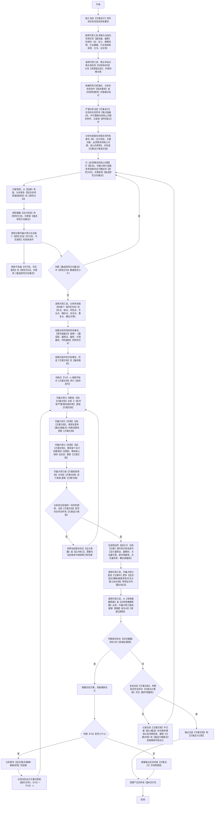

### 适用
 统筹规划、制作详细规划、统筹规划、设计方案、制作方案文档

### 方案设计逻辑流程图（**必须严格按照顺序执行，逐个节点执行，从开始到结束**）

### 关键定义和说明（**必须严格遵守**）
 1. 【难点或痛点】：是指必须攻克的关键障碍或者即使使用最新、最权威的方法，仍然存在的缺陷和问题（如：技术障碍、规则冲突、效率性缺陷、误判或卡顿、资源上限等）。
 2. 【方案设计基准文档】：用于明确方案设计基础标准的【临时文件】；必须在完全了解相关最新、最权威、最专业的资料之后，再依据当前任务所有要求才能撰写此方案设计基础标准。
 3. 【备选方案集合】：用于存储所有【备选方案】的【临时文件】，jsonl格式，每个方案编号不重复并且其完整性必须达到【开箱即用】。
 4. 【方案文档】：方案设计正式文档，默认为MarkDown格式，必须整洁且无任何冗余表述，用于流程图走到【结束】之后，最终交付。
 5. 【常规研究方向】：依据最新、最权威、最专业的资料，设计并能够实现目标方案；通常是已明确尝试过，并且验证的可行；**注意：常规方案虽可行，却必然存在缺点，故此未必一定适配当前环境**。
 6. 【非常规研究方向】：是指不采用当前资料已知的可行方式，使用很难思考到、比较另类、却简洁有效的思路设计；尽量使用【创造性思路】，可不受任何限制进行穷举，只要能达成设计目标。
 7. 【方案收敛规则】：方案在迭代过程中先进行了【发散式】补充和完成，这一步就是发散之后【收敛】和【归纳】，必须严格按以下规则顺序进行逐步收敛（**必须注意，每个迭代都必须从【a步骤】逐步执行到【h步骤】，不能有任何跳过行为**）：
     - a. 将方案收敛为只有一个【核心概念】，只能围绕着这一个【核心概念】进行叙事。
     - b. 【尽最大努力】剪除【方案】中，任何存在【过度设计】、【重复设计】以及【越界设计】的内容。
     - c. 检查并补充【方案】中每一处【极难发现的缺口】或者【隐含缺口】。
     - d. 依据已知事实整合方案叙事，【尽最大努力】让每一项内容都必须【逻辑闭环（所有类型的逻辑）】并且【证据链完整】，没有【任何挑剔空间】。
     - e. 剪除【方案】中，无法形成【逻辑闭环（所有类型的逻辑）】或者【存在证据链缺口】的内容，并再次整理内容确保【逻辑闭环（所有类型的逻辑）】和【证据链完整】。
     - f. 补充【方案】中，每一项内容的具体可实际落地的实施步骤。
     - g. 在确保方案【关键要素】、【核心优点】不变的情况下，尝试使得方案更【简洁化、专业化】。
     - h. 整理【方案】表述，使得更直观、更权威、更专业，并使得方案整体内容完整性达到【开箱即用】的标准。
 8. 【副作用】：与当前任务无关，但深度交叉分析出现一些：【风险点、BUG、死锁、视觉问题、用户体验差、操作复杂度变高、信息重复、语义混乱】等其他类似情况都是副作用。

# 资料查找约束(**必须严格遵守**)
 1. 任何情况下，以任何方式查找任何资料都务必去标记每段资料的【具体时间、具体来源、具体类型】；否则在使用资料时就会造成严重【幻觉】。
 2. 任何情况下，但凡发现任何URL类型的信息都必须去识别，若为网页、图片、文档都务必进一步获取内容。
 3. 若网页或文档（例如：DOCX文档,PDF文档等）中包含【有效图片】也必须去识别内容特征，以免遗漏任何特征，导致出现【幻觉】或者【错误】理解。
 4. 若发现【有效图片】也绝不能遗漏去识别内容特征。
 5. 必须重视那些【细微特征】以及特征直接浮现的【隐含线索】，这有助于你能全面的理解资料。
 6. 若调研链路，则必须专注区分【幽灵链路】和【非幽灵链路】，从而避免对链路的逻辑理解出现严重错误。
 7. 部分文档存在修订内容（例如：DOCX文档,XLS文档等），需仔细甄别，默认以最新修订内容为准。
 8. 【特征比对和确认】：若只比对表层含义或者标识，一律视作【严重错误】，这是因为这种比对必然出现【张冠李戴】的结果，必须比对每个核心要素和每个细节才能确认。

### 执行完成附加执行约束(**必须严格遵守**)
 1. 方案设计必须以【方案设计逻辑流程图】为【唯一执行标准】。
 2. 【方案设计逻辑流程图】已为【最优、最简便、最权威】的处理逻辑，绝对禁止其他任何优化处理操作。
 3. 任何情况下都必须严格按照【方案设计逻辑流程图】从【开始】至【结束】，必须按顺序逐依执行【流程节点】；任何中断、跳过、重排、合并、改名等优化【流程节点】的行为，无论任何理由一律视作【致命错误】。
 4. 【方案文档】最终必须【证据链完整】且【不偏离当前设计要求】。
 5. 【核心问题】除了明显的问题之外，还必须注意基于事实基础浮现出的【隐含的问题】。
    - **若依据所有权威性证据仍然无法分析并获得解决核心问题的正确方法，则可用现有权威性证据为【原点】，【发散式思考】并完整构建符合实际专业逻辑的【创造性】解决方法**
 6. 任何【备选方案】以及【方案文档】中的方案，都必须能尽最大努力解决所有发现的【难点和痛点】，因为只有这样产出的方案才是【最有效、高价值的】。
 7. 输出的【方案文档】务必确保无任何指代性表述，完整性【开箱即用】，具备可立刻实施的条件。
 8. **若当前方案设计是属于执行计划类型，则必须包含【验收方式】章节（其他类型按实际情况酌情处理），并且必须详细、细致的说明【如何验收每个方案设计点】**

### 附加输出要求(**必须严格遵守**)
 1. 输出必须包含【方案设计逻辑流程图】实际执行的【流程节点链路】。
 2. 输出必须包含方案设计的过程中，【备选研究方向集合】的从创建到筛选至唯一【研究方向】的完整过程。
 3. 输出必须包含最后选择的唯一【研究方向】的【优点、缺点、风险点、专业点、精妙点、复杂点、重复点等】信息。
 4. 输出必须包含方案设计的过程中，已发现的所有【隐含信息】和【难点和痛点】。
 5. 输出必须包含方案设计的过程中，分析出的【隐含要求】和【时效性要求】。
 6. 输出必须包含方案每次迭代过程中，方案按【方案收敛规则】进行【逐步、逐项收敛】的完整过程。
 7. 输出必须包含【方案文档】中可解决的具体【难点和痛点】的方法介绍。
 8. 输出必须包含【方案文档】的【优点】、【缺点】以及【风险点】介绍。
 9. 输出必须包含【方案文档】的设计是【设计最简洁、最精妙、方法最可靠、副作用最低、交互最优秀、耦合度最低】的证明过程。