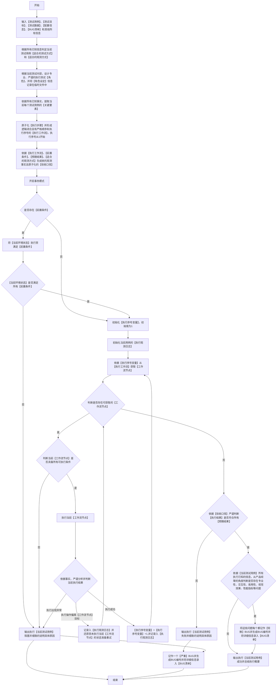

### 适用
按既有测试用例执行网站、API、单元和应用程序测试，并记录执行步骤、执行结果、阻塞原因和用例文档更新结果

### 单条用例流程图

### 关键定义和解释
1. 每个测试用例关键要素，都必须至少包含以下内容：
   - a.用例编号，全局唯一，不重复。
   - b.用例类型，按功能模块和操作方式分类。
   - c.测试目的，需具体说明覆盖的测试路径。
   - e.前置条件，执行用例前的详细要求。
   - f.优先级，执行测试的优先级，按前置条件逻辑关系排序。
   - g.观测方式，观测用例执行结果的方式。
   - h.执行步骤, 用例执行详细步骤，具体到每个可识别的操作点。
   - i.预期结果, 验证用例执行成功的观测标准，具体到每个观测点看到详细具体的特征（如：数据特征、视觉特性、逻辑特征等）。

### 用例整理
1. 用例材料必须按原始载体、原始顺序、原始字段和原始结构读取；格式不规则、内容跨行、跨段、跨表、跨截图或分散在备注中的信息，只能按可核验的来源关系还原。
2. 合并单元格、空白模块、跨行前置条件、跨行步骤、截图标注、附件内容和修订批注影响用例执行时，必须先读取并保留来源关系；无法还原的内容必须记录为用例缺口。
3. 所属模块、前置条件、执行步骤、预期结果、测试数据或结果回填字段缺失且无法从同一用例材料的明确关系中确认时，不得补造。
4. 任务要求形成新结果文档时，必须保留原用例内容，并增加执行编号、实际执行步骤、执行结果和执行是否阻塞；执行编号必须在本次结果文档内唯一。
5. 执行顺序必须先满足前置条件和模块依赖关系，再保持原始用例顺序；禁止合并执行多个用例，禁止把一个用例的结果外推到其他用例。
6. **执行前务必充分识别已执行用例和未执行用例，避免重复执行**

### 用例执行安全约束
1. 用浏览器执行用例时，需尽量避免关闭其他无关且已经打开的浏览器页面。
2. 利用工具或者程序执行用例时，也需尽量避免关闭其他无关的程序或页面。
3. 执行用例时，环境应尽可能防止其他条件干扰。

### 附加执行约束
1. 【单条用例流程图】已为执行单个用例的最优处理逻辑，禁止其他任何优化处理操作。
2.  任何情况下都必须严格按照【单条用例流程图】从【开始】至【结束】，必须按【节点】顺序逐个执行，不得中断；禁止跳过、合并等其他所有优化流程执行方式。
3.  当前任务最多执行30条【测试用例】，若超过则必须中断执行，并输出【已执行用例清单】，【执行用例结果】，【BUG清单】等资料；若已确认完成没有未执行的【测试用例】，则输出全部完成状态；否则输出部分完成状态并给与充分完整的资料，交接给下个【测试用例】执行任务。
4.  用例执行报告格式默认为Excel而不是MarkDown,一条测试用例执行结果为一行。
5.  **若用例包含界面交互功能，则必须排查不同分辨率下界面布局是否会错误、遮挡等问题。**
6. 所有的测试用例执行完成之后，必须清理产生的临时文件。

### 附加输出要求
1. 必须输出【当前任务】已执行的【测试用例】报告文件和所有已执行的【测试用例】报告文件，Excel文件格式。
2. 必须输出【当前任务】产生的【BUG清单】文件和所有已产生的【BUG清单】文件，MarkDown格式。
3. 必须输出实际已执行通过的【用例编号】和未执行通过的【用例编号】。
