### 适用
按已确认的需求、变更、接口、流程、风险、缺陷、验收口径或既有材料编写可执行测试用例

### 编写用例流程图（**必须严格按照顺序执行，逐个节点执行，从开始到结束,绝对不准违反任何规则**）

```mermaid
flowchart TD
START[开始] --> A[输入所有任务信息]
A --> B[依据任务信息，提取【测试对象】和需要覆盖的【测试范围】]
B --> C[调用可用工具，查找【测试对象】相关材料，严谨分析【可彻底分类项】和【无法彻底分类项】]
C --> D[提取【可彻底分类项】的已知材料，标记材料时序和评估权威性分数，并更新【调研笔记】]
D --> E{判断是否存在【无法彻底分类项】}
E -- 是 --> F[标记，需要以当前所有【最权威、最新】的证据为【原点】，更深度、更细节、更发散式的查找]
F --> C
E -- 否 --> G[修剪和排除超出【测试范围】的材料，并从当前已知材料中严谨分析逻辑和关系结构，尝试发现未调研的【显式线索】和未调研的【隐式线索】]
G --> G1{判断是否存在未调研的【显式线索】和未调研的【隐式线索】}
G1 -- 是 --> C
G1 -- 否 --> H[标记当前所有已知材料为【用例编写材料】，并将当前所有已知事实和线索更新到【调研笔记】中]
H --> H1[将【用例编写材料】中，【细微特征】、【极难发现的特征】、【隐含信息】作为【重点关注标记】，更新到【调研笔记】中]
H1 --> I[依据当前所有已知事实，查找【测试范围】内的所有【入口节点】和所有【出口节点】]
I --> J{判断是否已找到所有的【入口节点】和【出口节点】，并且已遍历查找【用例编写材料】}
J -- 是 --> K[依据当前所有已知事实，提取所有【路径节点】并标记所属【结构图位置】和【根源】，更新到【调研笔记】中]
J -- 否 --> H
K --> L[以【测试范围】内所有的【入口节点】为根节点，所有的【出口节点】为末端节点，构建或更新【测试路径有向结构图】]
L --> M[调用可用工具，依据【有向图遍历算法】，用更严谨、细致的方式，尝试发现未调研的【路径节点】]
M --> N{判断是否存在未调研的【路径节点】或【信息缺口】}
N -- 是 --> K
N -- 否 --> O{判断是否存在未分析的【用例编写材料】}
O -- 是 --> K
O -- 否 --> O1[【测试路径有向结构图】以MerMaid格式，更新到【调研笔记】中]
O1 --> P{依据当前所有已知事实，判断【测试路径有向结构图】包含的所有逻辑链路都已闭合}
P -- 是 --> Q[依据【测试路径有向结构图】和所有已知事实，分析并提取所有【可观察项】和所有【可操作项】]
Q --> Q1[尝试以测试对象符合的【业务领域】为基础，分析所有【可操作项】的组合]
Q1 --> Q2[严谨分析并重点标记那些【极难发现或极易忽视】且有概率会发生的【可操作项】的组合]
P -- 否 --> K
Q2 --> R[依据【测试路径有向结构图】和当前所有已知事实，编写完全符合【任务要求】的测试用例，构建或更新到【测试用例文档】]
R --> S[依据当前所有已知事实，调用可用工具，丰富测试用例并完善每个测试用例细节，更新到【测试用例文档】]
S --> T[依据【用例筛选规则】筛选完全符合的用例，同时更新【测试用例文档】]
T --> U{判断【测试用例文档】中所有用例，是否精确覆盖【测试路径有向结构图】所有路径}
U -- 否 --> R
U -- 是 --> V{严谨复核并评估【测试用例文档】中所有用例，交叉分析是否还需要更【复杂场景】的用例}
V -- 是 --> R
V -- 否 --> W[清理所有为当前任务创建的临时文件和【调研笔记】，并输出编写用例过程和【测试用例文档】]
W --> END[结束]
```

### 关键定义和说明（**必须严格遵守**）
1. 【调研笔记】：实际落地用于存储调研记忆的【临时目录】，可以存放多个文件，可回溯调研历史；编写用例全部完成之后就可删除。
2. 【用例编写材料】：编写测试用例的依据，若材料类型完全一致，则只选择最权威和最新的材料。
3. 【可彻底分类项】必须有事实依据作为支撑，否则一律视作【无法彻底分类项】；此分类目的是为了避免对材料理解出现错位、混淆、浅显等情况。
4. 【路径节点】：例如：变量调用、函数调用、入参特性、判断条件、事件触发机制、规则和环境条件、属性和配置信息等。
5. 【隐含信息】：隐含的信息必须基于事实进行分析（如：隐含的意图、线索、结论、规范、逻辑、时序等等），严禁将任何猜测当作隐含信息。
6. 【可观察项】：通常是指可观察到的且能产生具体变化的现象来源（如：响应内容、输出、截图等），可观察项会用于评估执行用例结果。
7. 【可操作项】：通常是指在符合测试对象【业务领域】和任务要求的情况下，实际可执行的操作步骤（如：模拟发送请求、点击某个按钮、输入某些文字、启动某个脚本或程序等符合测试对象【业务领域】的所有操作）。
    - **分析【可操作项】的组合，必须基于【业务领域】的情况下判断有哪些会实际发生的操作组合**
8. 【丰富测试用例】：严谨分析所有有效场景和所有有效复杂场景，从而使得实际测试场景更丰富；然后按所有已知事实和所有编写用例要求，添加有效的测试用例。
9. 【完善每个测试用例细节】：每个测试用例中，前置条件、执行步骤、预期结果、测试目的等绝不允许使用概括性描述，至少符合以下要求：
    - 前置条件和执行步骤都可实际操作。
    - 预期结果可获取实际证据和需要观察的所有关键特征。
    - 测试目的表述清晰，清晰到若执行步骤意外出错，依据测试目的能给出具体的修复方向。

10. 【用例筛选规则】，至少符合以下几项：
   - 用例对应的目标路径必须不能完全相同。
   - 用例必须存在有效的【测试目的】，并且不能重复。
   - 用例存在实际测试意义和实际测试价值。
   - 用例必须完全符合【测试范围】的所有要求；不能超出【测试范围】。

11. 【测试用例文档】:实际落地的文件，Excel格式，标准的测试用例文档风格。

### 测试用例编写原则（**必须严格遵守**）
1. 每个用例必须有确定的验收目标类型（例如：功能、冒烟、回归、边界、性能、稳定性等）。
2. 若无任何要求，则在完全符合所有测试要求的情况下，至少要有：所有功能测试、所有冒烟测试、所有边界测试、所有稳定性测试。
3. **若存在实际代码，则允许构建代码走查用例，否则严格禁止出现代码走查用例；用例的测试目的都必须围绕着【功能实现的检查】、【容易遗漏的检查点】、【极难发现的特殊逻辑】进行展开**
4. 写用例技巧：类似于：入参特性、变量调用、函数调用、判断条件、事件触发机制、规则和环境条件、属性和配置信息、视觉效果、第三方引用等都是需重点关注的节点，可依据测试要求和实际操作链路去严谨分析哪些需要编写成测试用例。
5. 若发现一些极其微小的特征或差异（例如：数据、时序、视觉、状态、类型等方面上的特征或差异），这样细节也必须作为重点来进行测试用例编写。
6. 若测试对象含界面，则绝不能遗漏编写相关界面测试用例。
7. 写测试用例根本目的，至少基于以下几点对目的性的理解去编写：
   - a.确保目标对象正常流程走通。
   - b.帮助目标对象探索哪些非常不容易发现的问题。
   - c.帮助目标对象适应非常复杂的场景。

### 附加全局约束
1. 【编写用例流程图】已为【最优、最简便、最权威】处理逻辑，禁止其他任何优化处理操作。
2. 任何情况下都必须严格按照【编写用例流程图】从【开始】至【结束】，必须按【节点】顺序逐个执行；任何中断、跳过、重排、合并、改名等优化【流程节点】的行为，无论任何理由一律视作【致命错误】。
3. 在做分析时，绝不能遗漏相关视觉特性分析、逻辑特性分析、关联结构分析、输入特性分析和输出特性分析。
4. 编写每个测试用例时，至少包含以下关键要素：
   - a.用例编号，全局唯一，不重复。
   - b.用例类型，按功能模块和操作方式分类。
   - c.测试目的，需具体说明覆盖的测试路径。
   - e.前置条件，执行用例前的详细要求。
   - f.优先级，执行测试的优先级，按前置条件逻辑关系排序。
   - g.观测方式，观测用例执行结果的方式；**代码走查也属于观测方式的一种**。
   - h.执行步骤, 用例执行详细步骤，具体到每个可识别的操作点;**若为代码，则每个步骤都锁定为核心关键点**。
   - i.预期结果, 验证用例执行成功的观测标准，具体到每个观测点看到详细具体的特征（如：数据特征、视觉特性、逻辑特征等）。
5. **测试目标若包含界面交互内容，则必须包含界面交互相关的测试用例，并且需保证覆盖所有操作路径；同时必须考虑不同分辨率的场景。**
6. 最终输出的所有测试用例，至少覆盖以下几方面内容的用例，否则直接视作编写用例失败：
   - a.所有功能路径。
   - b.所有交互路径。
   - c.所有数据流路径和操作路径。
   - d.所有判断逻辑涵盖的路径。
7. 【特征比对和确认】：若只比对表层含义或者标识，一律视作【严重错误】，这是因为这种比对必然出现【张冠李戴】的结果，必须比对每个核心要素和每个细节才能确认。
8. 调研过程中，尽可能鉴别【幽灵特征】，因为【幽灵特征】会引导至错误的执行结果。
9. 部分文档存在修订内容（例如：DOCX文档），需仔细甄别，默认以最新修订内容为准。

### 附加输出要求
1. 输出时必须附带已完全编写完成的【测试用例文档】的绝对路径。
2. 必须记录并输出按【编写用例流程图】实际执行的【流程节点链路】，包含所有判断节点的分支走向。
3. 输出必须包含，调研测试对象的过程中发现的【隐式线索】和【隐含信息】。
4. 输出必须包含，调研测试对象的过程中，已发现的【细微特征】和【极难发现的特征】。
5. 输出必须包含，每个测试对象的每个测试范围所有的【入口节点】和【出口节点】。
6. 输出必须包含，调研测试对象的过程中，相关材料【可彻底分类】的具体依据。
7. 输出必须包含，编写测试用例时，考虑的场景，特别是极难被注意到且非常关键的复杂场景。
8. 输出必须包含，编写测试用例时，考量业务领域的情况下，所有【可操作项的组合】。
9. 输出必须包含，调研测试对象的过程中，已获取的【极难发现或极易忽视】且有概率会发生的【可操作项】的组合。
10. 输出必须包含，【有向图遍历算法】使用的具体过程。
11. 输出必须包含，论证【测试用例文档】完全覆盖【测试路径有向结构图】所有路径的具体过程。