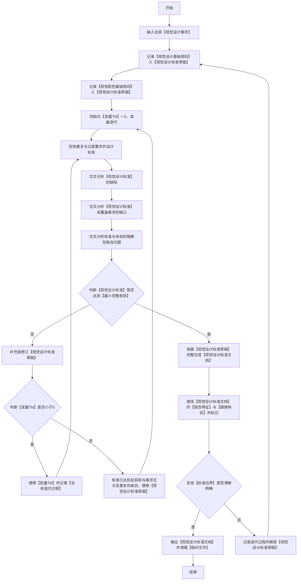
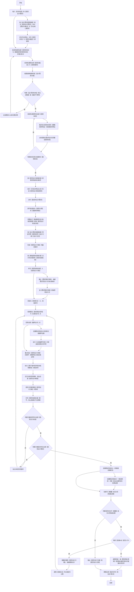

## 适用
依据任务需求，完成视觉设计产出（图片/代码/Mermaid图），并确保设计符合视觉设计目标与任务约束；全流程以【最小完整收敛】为统一核心概念执行。
### 构建视觉设计标准流程图（必须严格按照顺序执行，逐个节点执行，从开始到结束）

### 视觉设计逻辑流程图（必须严格按照顺序执行，逐个节点执行，从开始到结束）

### 关键定义和解释(**必须严格遵守**)
 1. 【设计过程文件】：用于控制设计过程信息存取的文件集合：【设计笔记】（过程记忆：功能区、细微特征、需求分析、调研结果、核验结果、决策依据等）、【设计需求文档】（全部【视觉设计需求】及其完整理解）、【视觉设计标准草稿】（迭代完善中的标准）、【视觉设计标准文档】（最终标准）均为临时文件，设计完成后删除；【视觉设计方案】为正式文件，可输出展示给用户，设计完成后不删除。
 2. 【视觉功能区】：用于控制调研范围与比对颗粒度的划分单元，指设计产出物中可按功能和视觉边界划分的独立区域（如导航栏、内容区、侧栏、卡片组、图例区等），每个功能区必须具备明确的视觉边界和交互语义。
 3. 【视觉体系】：用于控制调研基准与设计取舍的对象范围，例如设计风格、配色方案、功能区、布局系统、间距规范、视觉组件等。
 4. 【视觉设计基础规则】：用于控制【视觉设计标准】初始生成的规则底座，任何方案必须遵守并允许拓展：
    - a.**若存在现有视觉体系则必须以此为基础进行设计**
    - b.字号：默认普通字体；加粗则（强调性+0.5）；字号大一级则（强调性+1），字号小一级则（强调性-1）。
    - c.间距：【同类型或同组】视觉元素默认普通间距，非同类型视觉元素则增加间距；**与各种视觉组件之间默认保留普通间距**。
    - d.布局：按功能区主次和信息密度划分，越核心或信息密度越大的功能区布局面积越大，相反越小；**默认选择【紧凑型】布局**。
    - e.边框：边框用于视觉分隔，【不同视觉状态】或【不同类别的视觉容器】需做区分时使用；**视觉元素默认按需处理，视觉容器默认不需要边框**。
    - f.阴影或遮罩：需体现【视觉上的层次感】时使用，否则无需使用。
    - g.边框和背景的强调性：单侧边框（强调性+0.25）；高对比背景色（强调性+2），低对比背景色（强调性+0.5）。
    - h.视觉分组或分页：同一种【业务、概念、体系】的【视觉元素】应尽量放置在同一个【视觉容器】或页面。
    - i.用户体验：操作难度小，**从视觉元素可直观理解如何操作**；**绝对禁止设计出让用户茫然不知如何操作的视觉**。

 5. 【视觉配色基础规则】：用于控制配色类标准生成的规则底座，任何方案必须遵守并允许拓展：
    - a.若存在现有配色方案则必须以此为基础；若没有，默认主色约60%、辅助色约30%、强调色约10%，比例按产出载体形态调整。
    - b.默认简约配色风格，文案强调程度相同的使用相同配色。
    - c.文案语义相同的尽量使用相同配色。
    - d.提示性颜色默认轻量、简约，尽量避免出现视觉噪点。
    - e.视觉状态相同的尽量使用相同的配色体系。
    - f.无需强调的视觉元素或视觉状态，默认使用一般对比度的配色。
    - g.配色需提供【视觉引导】性，支撑【视觉设计基础规则】i 的直观可操作要求。

 6. 【基础视觉验收标准】：用于控制【视觉验收标准】设计起点的验收底座：
    - a. 必须调用可用工具获取视觉特征（图片载体用图像识别、代码载体用结构查询与样式解析、Mermaid图载体用图结构核对），重点关注细微视觉特征和极难发现的视觉特征。
    - b. 必须符合视觉常理（例如：没有视觉元素遮盖，没有视觉连接点错位等）。
    - c. 从视觉上必须达到开箱即可操作。
    - d. 单一视觉状态下，视觉上强调内容不得超过10%。
 7. 【细微视觉特征】：用于控制调研提取与比对核验的特征颗粒度，指每个功能区内不可再分的原子级视觉属性，至少包含：
    - a.色彩特征：色值、对比度、色相、饱和度、透明度
    - b.间距特征：元素内间距、外间距与组间距的精确数值和相对比例（代码载体对应padding/margin/gap）
    - c.字体排印特征：字号、字重、行高、层级归属（四级文案体系）
    - d.层次特征：层叠顺序（代码载体对应z-index）、阴影层级、视觉重量（深色≈浅色×1.8、右侧≈左侧×1.15）
    - e.布局特征：布局方式（代码载体对应Grid/Flexbox）、对齐基准线、关键尺寸断点（代码载体必核响应式断点）
 8. 【设计需求适配维度】：用于控制需求核对与【视觉组件】筛选覆盖面的维度集合，至少包含：产出载体形态（图片/代码/Mermaid图）、目标受众与使用场景、信息层级与交互复杂度、交互状态与反馈完整性、行业与合规性要求、响应式与分辨率适配（限代码载体）；每个维度核对输出两类标记：【需求关键点】（该维度内直接影响设计成败的具体要求）与【专业核心要求】（该维度对应的权威专业规范条目）。
 9. 【视觉设计结构查询】：用于控制现有视觉设计结构信息的获取机制，对象为现有【视觉体系】全部类目、各【视觉功能区】边界与其现状，方式为按【细微视觉特征】a至e逐类提取；查到项作为设计基础，未查到项记为需新建项。
 10. 【已标记特征比对】：用于控制【视觉设计缺陷清单】的归因依据生成程序，以全部已重点标记的特征为比对基准逐项对照；以下情形记为命中：同一属性取值冲突、同类元素规格不一致、视觉表现与业务语义不匹配、已标记要求存在未对应实现；命中项逐项归因后形成【视觉设计缺陷清单】，无比对命中时该清单记为空。
 11. 【需求落实清单】：用于控制设计需求到方案设计点再到标准条目的映射核验，逐条记录“设计需求→方案设计点→对应【视觉设计标准】条目→核验结果”的映射表；核验结果仅有两种取值：已落实且符合标准、待修正；全部条目核验为已落实且符合标准时清单闭合，待修正项转入方案迭代修正。
 12. 【反证证据判定】：判定结论Y与结论X的证据关系。假设性结论X为视觉概念最立体、设计视角最专业、视觉表达最直观、用户体验最棒四个维度的合取断言；任一维度不成立则结论X不成立。假设性结论Y为结论X的取反断言；成立条件为至少一个维度不成立。证实结论Y与【推翻】结论X共用同一批证据；假设性结论Y与结论X共用同一条反证动线；枚举：权威设计规范或设计体系条目、权威UX/UI研究与可用性结论、公认成熟设计模式、同场景更优实践案例。以已标记的【专业核心要求】为基准检索；任一证据表明存在比当前【视觉设计方案】及其依据的【视觉设计标准】更专业的做法；该证据判定为可【推翻】结论X的【权威证据】。
 13. 【过度越界判定】：用于控制【过度设计】与【越界设计】命中判定的核验程序，假设性结论Z断言当前【视觉设计方案】存在【过度设计】或【越界设计】；以【设计需求文档】、【需求落实清单】与【视觉设计标准】为基准逐项核验：过度设计命中判据取值枚举为无需求对应的纯装饰元素、超出信息层级与交互复杂度的视觉复杂度、重复表达同一视觉目的的元素组、单一视觉状态下强调内容超过10%；越界设计命中判据取值枚举为超出【设计需求文档】边界的视觉功能区或视觉元素、偏离现有【视觉体系】基础引入的视觉表达、超出任务产出载体范围的实现方式；命中项逐条收敛修正，命中与修正记录须完整披露于执行完成输出。
 14. 【最小完整收敛】：全技能统一核心概念，指任何设计产物必须收敛到可验证完整覆盖全部设计需求的最小集合：①达标判据：已覆盖【设计需求文档】全部【需求关键点】，且缺陷、缺口、细微问题三类交叉分析本轮均无新增项；②最小判据：标准已达标后剪除与需求无关、重复、过度、越界的条目；③兜底判据：迭代超限时停止推翻重做，按【需求落实清单】收敛输出当前最优版本并逐条披露未闭合项。

### 附加执行约束(**必须严格遵守**)
 1. 视觉设计必须以【视觉设计逻辑流程图】为【唯一执行标准】。
 2. 【视觉设计逻辑流程图】和【构建视觉设计标准流程图】已为【最优、最简便、最权威】的处理逻辑，绝对禁止其他任何优化处理操作。
 3. 任何情况下都必须严格按照【视觉设计逻辑流程图】从【开始】至【结束】，必须按顺序逐依执行【流程节点】；任何中断、跳过、重排、合并、改名等优化【流程节点】的行为，无论任何理由一律视作【致命错误】。
 4. 设计过程文件落盘：【设计笔记】、【设计需求文档】、【视觉设计标准草稿】与【视觉设计标准文档】的任何新增、修订、删除，都必须同步更新到实际文件。
 5. **禁止出现【视觉概念表达混乱】、【语义混乱】、【视觉信息重复】等视觉设计思路**
 6. 【视觉设计标准】与【视觉验收标准】均不得偏离当前设计需求，必须约束并核验所有边界条件；标准在限定场景内必须留有创造性且可控的空间，禁止过度约束。
 7. 所有流程节点均须依据当前全部已知事实与上游节点产出、尽最大努力执行；节点文本只保留核心动作、对象与目的，落盘去向由第4条统一承载。
 8. 流程路径以两张流程图的连线为准；关键定义和解释与附加执行约束章节只承载概念与规则本身，不描述流程路径。
 9. 需获取环境或外部信息时，统一调用可用工具执行。

### 执行完成附加输出要求(**必须严格遵守**)
 1. 输出必须包含整个设计过程按【视觉设计逻辑流程图】实际执行的【流程节点】链路，包含所有判断节点的分支走向和循环次数。
 2. 输出必须包含已识别出的现有【视觉体系】完整内容和现有【视觉功能区】，以及已搜索到的现有【细微视觉特征】和【极难发现的视觉特征】。
 3. 输出必须包含对【视觉设计需求】详细的理解，包括对【隐含的设计需求】详细的理解；必须详细描述重点关注的【极难发现的视觉状态】。
 4. 输出必须包含已分析出的所有【视觉设计标准】和所有【视觉验收标准】。
 5. 输出必须包含审查【视觉设计方案】是否完全符合所有【视觉设计标准】的完整过程。
 6. 输出必须包含已发现的【过度设计】或【越界设计】的内容。
 7. 输出必须包含已发现的【漏洞】或【不合理点】的内容。
 8. 输出必须包含【已标记特征比对】的执行记录：比对基准清单、命中的不一致或矛盾项、【视觉设计缺陷清单】全部条目及逐条归因依据；迭代超限收敛输出时，必须逐条披露未闭合项及原因。
 9. 输出必须包含【设计需求适配维度】各维度的核对结果与【需求关键点】、【专业核心要求】两类标记清单，以及【视觉设计结构查询】的结果与缺项清单。
 10. 输出必须包含【需求落实清单】全部条目及核验结果、假设性结论X与假设性结论Y的判定记录及【反证证据判定】的检索与判定过程、迭代计数【变量TN】与【变量SN】的实际取值及各轮迭代过程记录。