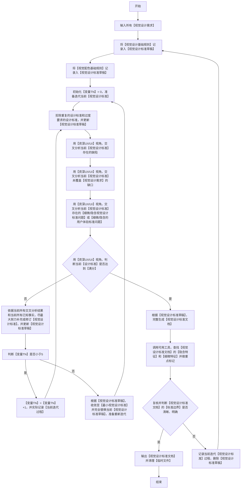
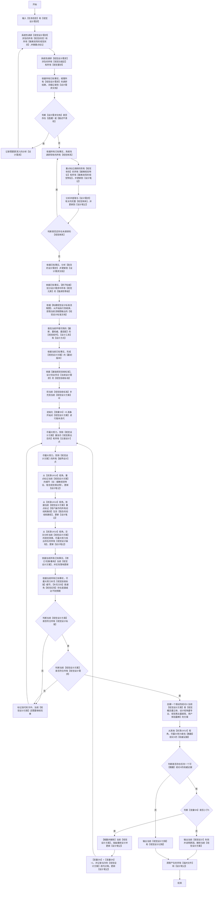

## 适用
依据任务需求，完成视觉设计产出（图片/代码/Mermaid图），并确保设计符合所有【设计约束】、视觉设计目标和任务约束。
### 构建视觉设计标准流程图（必须严格按照顺序执行，逐个节点执行，从开始到结束）

### 视觉设计逻辑流程图（必须严格按照顺序执行，逐个节点执行，从开始到结束）

### 关键定义和解释(**必须严格遵守**)
 1. 【设计笔记】：实际落地用于存储设计过程记忆的【临时目录】，记录所有功能区、细微特征、需求分析、调研结果、核验结果和决策依据等，设计完成之后可删除。
 2. 【设计需求文档】：实际落地用于存储设计需求的【临时文件】，记录所有的【视觉设计需求】以及对【视觉设计需求】完整的理解，设计完成之后可删除。
 3. 【视觉设计标准草稿】：实际落地用于存粹迭代完善视觉设计标准中的【临时文件】，视觉设计标准完成之后可删除。
 4. 【视觉设计标准文档】：实际落地用于存储视觉设计标准的【临时文件】，记录所有与设计需求有关的【视觉设计标准】，设计完成之后可删除。
 5. 【视觉设计方案】：实际落地用于存储完全符合所有设计需求的【正式文件】，可输出展示给用户，设计完成之后【不删除】。
 6. 【视觉功能区】：设计产出物中可按功能和视觉边界划分的独立区域（如：导航栏、内容区、侧栏、卡片组、图例区等），每个功能区必须具备明确的视觉边界和交互语义。
 7. 【视觉体系】：例如：设计风格、配色方案、功能区、布局系统、间距规范、视觉组件等。

 8. 【视觉设计基础规则】：任何涉及方案都必须遵守以下视觉设计规则，同时也允许基于以下规则进行拓展：
    - a.**若存在现有视觉体系则必须以此为基础进行设计**
    - b.字号：默认普通字体，加粗则（强调性+0.5）；其他情况，字号大一级则（强调性+1），字号小一级则（强调性-1）。
    - c.间距：【同类型或同组】视觉元素默认普通间距，非同类型视觉元素则增加间距;**与各种视觉组件之间默认保留普通间距**。
    - d.布局：按功能区主次和信息密度划分，越核心或信息密度越大的功能区，布局相对面积越大；相反，布局相对面积越小；**并且无论任何情况，布局都务必考虑不同分辨率下的自适应性**；**默认选择【紧凑型】布局**。
    - e.边框：边框的核心用途，是视觉效果上的分隔，因此，【不同视觉状态】或【不同类别的视觉容器】若需要做视觉区分，就需要使用边框；其他情况，按实际选择需要和不需要；**视觉元素默认按需处理，视觉容器默认不需要边框**。
    - f.阴影或遮罩：若需要体现【视觉上的层次感】，需要使用阴影或遮罩；否则，无需使用阴影或遮罩。
    - g.边框和背景的强调性：边框总共有上下左右四个侧面，单侧边框（强调性+0.25）；背景色（对比度高的颜色强调性+2,对比度低的颜色强调性+0.5）。
    - h.视觉分组或分页：同一种【业务、概念、体系】的【视觉元素】应尽量放置在同一个【视觉容器】或页面；其他情况则根据设计需求酌情考虑。
    - i.用户体验：在以上这些规则基础之上，还需要考虑尽量让用户体验比较好，操作难度小；**可以非常直观的从视觉元素上让用户理解，我该如何操作**；**绝对禁止设计出的视觉，让用户看到一片茫然不知道该如何操作**。

 9. 【视觉配色基础规则】任何涉及方案都必须遵守以下配色规则，同时也允许基于以下规则进行拓展：
    - a.若存在现有配色方案则必须以此为基础；若没有，默认以主色>=60%背景区、辅助色<=30%卡片面板、强调色<=10%。
    - b.默认简约配色风格，文案强调程度相同的使用相同配色。
    - c.文案语义相同的尽量使用相同配色。
    - d.提示性颜色默认轻量、简约，尽量避免出现视觉噪点。
    - e.视觉状态相同的尽量使用相同的配色体系。
    - f.无需强调的视觉元素或视觉状态，默认使用一般对比度的配色。
    - g.配色需提供一定的【视觉引导】性，让用户开箱即知道如何操作。

 10. 【基础视觉验收标准】：用于在最终视觉设计方案落地，**对形成的视觉效果进行验收**，必须遵守以下规则，同时也允许基于以下规则进行拓展：
    - a. 必须通过合理的工具获取视觉特征，同时重点关注细微视觉特征和极难发现的视觉特征。
    - b. 必须符合视觉常理（例如：没有视觉元素遮盖，没有视觉连接点错位等）。
    - c. 从视觉上必须达到开箱即可操作，绝不会出现开箱不知道如何操作。
    - d. 单一视觉状态下，视觉上强调内容不得超过10%。

 11. 【细微视觉特征】：每个功能区内不可再分的原子级视觉属性，至少包含：
    - a.色彩特征：色值、对比度、色相、饱和度、透明度
    - b.间距特征：padding/margin/gap的精确数值和相对比例
    - c.Typography特征：字号、字重、行高、层级归属（四级文案体系）
    - d.层次特征：z-index、阴影层级、视觉重量（深色≈浅色×1.8、右侧≈左侧×1.15）
    - e.布局特征：Grid/Flexbox使用方式、对齐基准线、响应式断点
  
### 附加执行约束(**必须严格遵守**)
 1. 视觉设计必须以【视觉设计逻辑流程图】为【唯一执行标准】。
 2. 【视觉设计逻辑流程图】和【构建视觉设计标准流程图】已为【最优、最简便、最权威】的处理逻辑，绝对禁止其他任何优化处理操作。
 3. 任何情况下都必须严格按照【视觉设计逻辑流程图】从【开始】至【结束】，必须按顺序逐依执行【流程节点】；任何中断、跳过、重排、合并、改名等优化【流程节点】的行为，无论任何理由一律视作【致命错误】。
 4. 设计笔记落盘：设计笔记任何的新增、修订，删除处理都必须更新到实际的文件。
 5. 视觉设计标准文档落盘：视觉设计标准任何的新增、修订，删除处理都必须更新到实际的文件。
 6. **禁止出现【视觉概念表达混乱】、【语义混乱】、【视觉信息重复】等视觉设计思路**。
 7. 视觉设计标准不得偏离当前设计需求，其规则必须约束所有边界条件，**在限定场景内必须留有一定创造性且可控的空间，禁止过度约束**。
 8. 视觉验收标准不得偏离当前设计需求，其标准必须核验所有边界条件。

### 执行完成附加输出要求(**必须严格遵守**) 
 1. 输出必须包含整个设计过程按【视觉设计逻辑流程图】实际执行的【流程节点】链路，包含所有判断节点的分支走向和循环次数。
 2. 输出必须包含已识别出的现有【视觉体系】完整内容和现有【视觉功能区】。
 3. 输出必须包含已搜索到的现有【细微视觉特征】和【极难发现的视觉特征】。
 4. 输出必须包含对【视觉设计需求】详细的理解，包括对【隐含的设计需求】详细的理解；必须详细描述重点关注的【极难发现的视觉状态】。
 5. 输出必须包含已分析出的所有【视觉设计标准】和所有【视觉验收标准】。
 6. 输出必须包含审查【视觉设计方案】是否完全符合【视觉设计标准】的完整过程。
 7. 输出必须包含已发现的【过度设计】或【越界设计】的内容。
 8. 输出必须包含已发现的【漏洞】或【不合理点】的内容。